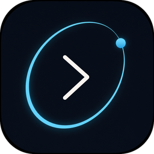

<p align="center">
  
</p>

<h1 align="center">Orbit</h1>

<p align="center">
  <strong>Stay in the flow.</strong><br>
  A fast, lightweight, project-centric terminal emulator built in Zig.
</p>

<p align="center">
  <a href="https://github.com/marksikaundi/Orbit/releases/latest"></a>
  <a href="https://github.com/marksikaundi/Orbit/tree/2026-live"></a>
  <a href="LICENSE"></a>
  <a href="https://ziglang.org/"></a>
</p>

<p align="center">
  <a href="#quick-start">Quick start</a> ·
  <a href="INSTALL.md">Install guide</a> ·
  <a href="how-to-use.md">How to use</a> ·
  <a href="CONTRIBUTING.md">Contribute</a> ·
  <a href="https://github.com/marksikaundi/Orbit/releases">Releases</a>
</p>

---

Orbit is a GPU accelerated terminal inspired by Ghostty’s performance focus, with one core idea: **keep developers in the flow by organizing everything around projects.**

Unlike traditional terminals that only launch shells, Orbit remembers workspaces, restores sessions, and stays out of your way.

```text
  ○───────────────○
       O R B I T
  > stay in the flow_
```

---

## Why Orbit?

| Terminal | Focus |
| :------- | :---- |
| Ghostty | Speed |
| Warp | UX |
| WezTerm | Configuration |
| **Orbit** | **Projects** |

Everything revolves around the developer’s workflow — Backend, Frontend, Production, University — as first-class workspaces, not afterthoughts.

### Core values

| | | |
| :--- | :--- | :--- |
| Fast | Lightweight | Beautiful |
| Project-centric | Privacy-first | Extensible |
| Cross-platform | | |

### Design principles

1. Performance first  
2. Minimal UI — no unnecessary features  
3. GPU-accelerated rendering  
4. Native experience on every platform  
5. Stable architecture & memory safety through Zig  
6. Project-aware workflows  

---

## Features

### Terminal foundations

- Startup **home screen** — welcome, logo, version, quick actions
- **GPU-rendered** text with dirty-cell redraws
- POSIX PTY (Linux / macOS) and ConPTY (Windows)
- Full ANSI parsing — CSI, OSC, SGR, DEC, DCS, UTF-8
- Colors, cursor, scrolling, selection, clipboard
- **Syntax-highlighted file editor** (JS, Python, Java, Zig, and more) with autocomplete and short docs
- Tabs, split panes, search, themes, transparency
- TOML config with **live reload** (no restart)

### Orbit Workspaces

Projects are first class. Each workspace can remember:

| Remembers | Examples |
| :-------- | :------- |
| Working directory | `~/code/api` |
| Tabs & splits | layout you left open |
| Shell & environment | zsh, nvm, PATH |
| Restore state | pick up where you stopped |

### Extensibility

- **Command palette** — jump to any action fast
- **Plugin system** — commands, themes, custom shortcuts, hooks
- **Optional AI** (Phase 7) — explain errors & suggest commands; never executes automatically

---

## Status

**Phases 1–6 are implemented** — terminal foundations through the command palette, plus a manifest-based plugin system (commands, themes, custom shortcuts, hooks).

Next up: optional AI assistant (**Phase 7**). Full detail in [roamap.md](roamap.md).

| Phase | Focus | |
| :---: | :---- | :-: |
| 1 | MVP — window, PTY, shell I/O, text, keyboard | done |
| 2 | ANSI, colors, resize, scroll, cursor, clipboard | done |
| 3 | Tabs, splits, search, themes, config | done |
| 4 | Orbit Workspaces | done |
| 5 | Command palette | done |
| 6 | Plugin system | done |
| 7 | Optional AI assistant | next |

---

## Quick start

**Full install for macOS, Linux, and Windows:** → **[INSTALL.md](INSTALL.md)**

```bash
git clone https://github.com/marksikaundi/Orbit.git
cd Orbit

# macOS:  brew install zig glfw
# Linux:  Zig 0.16+ + GLFW / OpenGL / X11  (see INSTALL.md)
# Windows (PowerShell): Zig 0.16+ + GLFW via vcpkg  (see INSTALL.md)

zig build          # → zig-out/bin/orbit  (orbit.exe on Windows)
zig build run      # detached launch
zig build run-fg   # foreground (logs in this terminal)
zig build setup    # once: global `orbit` + zig build run from anywhere
zig build test
zig build security-scan
```

After `zig build setup`, open a new terminal tab:

```bash
orbit              # launch from any folder
zig build run      # same — builds & launches detached
```

Both print `Orbit terminal opened successfully` and return to your prompt.

```bash
ORBIT_FOREGROUND=1 orbit   # live logs in this terminal (Unix)
# Windows:  $env:ORBIT_FOREGROUND=1; orbit
```

Connect Orbit as an **external** terminal (the editor’s built-in panel stays):

```bash
orbit ide-setup          # Cursor, VS Code, and others it finds
```

Details: [how-to-use.md](how-to-use.md#connect-to-cursor-vs-code-and-other-ides).

Optional config:

```bash
# Unix
mkdir -p ~/.config/orbit
cp assets/config.example.toml ~/.config/orbit/config.toml

# Windows (PowerShell)
New-Item -ItemType Directory -Force "$env:APPDATA\orbit" | Out-Null
Copy-Item assets\config.example.toml "$env:APPDATA\orbit\config.toml"
```

> **Windows:** native ConPTY build is supported — see [INSTALL.md § Windows](INSTALL.md#windows). WSL2 remains an alternative.

Day-to-day usage: [how-to-use.md](how-to-use.md).

---

## Configuration

Orbit watches config changes and reloads automatically — no restart required.

```toml
font = "JetBrains Mono"
font_size = 14
theme = "Orbit Dark"
opacity = 0.95
cursor = "beam"
padding = 10
```

Workspaces live in `~/.config/orbit/workspaces/<name>.toml`.

---

## Shortcuts

| Shortcut | Action |
| :------- | :----- |
| `Ctrl+Shift+H` | Home screen |
| `Ctrl+Shift+P` | Command palette |
| `Ctrl+Shift+T` | New tab |
| `Ctrl+Shift+W` | Close tab |
| `Ctrl+Tab` / `Ctrl+Shift+Tab` | Next / previous tab |
| `Ctrl+Shift+]` / `[` | Next / previous tab |
| `Ctrl+Shift+D` | Split horizontal |
| `Ctrl+Shift+E` | Split vertical |
| `Ctrl+PageDown` | Focus next pane |
| `Ctrl/Cmd+Shift+F` | Search terminal or workspace files |
| `Cmd+C` / `Cmd+V` | Copy / paste (macOS) |
| `Ctrl+C` / `Ctrl+V` | Copy (when selected) / paste (Windows/Linux) |
| `Ctrl/Cmd+Shift+C` / `V` | Copy / paste (all platforms) |
| Right-click | Copy / Paste context menu |
| `Ctrl/Cmd+=` / `-` / `0` | Font larger / smaller / reset |
| `Ctrl+Shift+O` | Open folder as workspace |
| `Ctrl+Shift+S` | Save layout as workspace |
| Drag + release | Select text (copies on release) |
| Scroll / PageUp/Down | Scrollback |

Palette commands include New Tab, Split Right/Down, Open Workspace, Load Saved Workspace, Save Workspace, SSH, Theme, Font size, Settings, Reload Config/Plugins, and anything plugins contribute.

---

## Plugins

Install by copying a folder with `plugin.toml` into `~/.config/orbit/plugins/<name>/`:

```bash
cp -R assets/plugins/* ~/.config/orbit/plugins/
# or: home → Plugins → I
```

Then **R** in the Plugins panel (or restart). Commands and themes show up in the palette.

Customize shortcuts in any `plugin.toml`:

```toml
shortcut = "ctrl+shift+g"
# or
[[bindings]]
```

Start with the bundled **`keys`** plugin → [`assets/plugins/README.md`](assets/plugins/README.md).

---

## Tech stack

| Layer | Choice |
| :---- | :----- |
| Language | Zig |
| Graphics | OpenGL (WebGPU later) |
| Windowing | GLFW |
| Fonts | SF Mono via stb_truetype |
| Shell I/O | POSIX PTY · Windows ConPTY |
| Configuration | TOML |
| Testing | `zig build test` |
| Security | `zig build security-scan` (CI on every PR) |
| Build | Zig Build |

**Why Zig?** Tiny binaries, excellent C interop, explicit memory management, strong performance and cross-compilation — built for systems work.

---

## Architecture

Every layer is isolated:

```text
Application → Window → Input → PTY → ANSI Parser → Screen Buffer → Renderer → GPU
```

| Module | Responsibilities |
| :----- | :--------------- |
| **Window** | Create/resize, clipboard, DPI, cursor, monitor |
| **PTY** | Shell I/O & resize (Linux, macOS, Windows) |
| **ANSI Parser** | CSI, OSC, SGR, DEC, DCS, UTF-8 |
| **Screen Buffer** | Cells, attributes, hyperlinks, dirty flags |
| **Renderer** | Glyph cache, atlas, vertices; dirty cells only |
| **Input** | Keyboard, mouse, clipboard, shortcuts, IME |
| **Configuration** | `config.toml` with automatic reload |

```text
Window → Renderer → Glyph Cache → Vertex Buffer → GPU → Screen
```

---

## Performance targets

| Metric | Target |
| :----- | :----- |
| Startup | &lt; 50ms |
| Idle memory | &lt; 30MB |
| Input latency | &lt; 5ms |
| Frame rate | 144+ FPS |

---

## Platforms

| Platform | Shell backend |
| :------- | :------------ |
| Linux | Native PTY |
| macOS | Native PTY |
| Windows | ConPTY |

One shared PTY interface across platforms.

---

## Roadmap

| Version | Milestone |
| :------ | :-------- |
| v0.1 – v0.5 | Terminal → ANSI → themes → tabs → splits |
| v0.6 | Workspaces |
| v0.7 | Plugins |
| v0.8 | Search |
| v0.9 | Performance |
| **v1.0** | **Stable release** |

**Later ideas:** SSH manager, cloud sync, workspace sharing, remote development, session recording, image protocol, GPU effects, multi-cursor, terminal replay, command timeline.

See [roamap.md](roamap.md) for full phase detail · [CHANGELOG.md](CHANGELOG.md) for shipped changes.

---

## Repository layout

```text
src/          app, renderer, parser, terminal, workspace, config,
              platform, window, pty, font, clipboard, ui, plugins, tests
assets/       icons, config example, plugins, shell hooks
scripts/      setup, launch, macOS bundle, version bump
build.zig
```

---

## Contributing

Bug fixes, tests, docs, plugins, and features that fit Orbit’s design principles are welcome.

→ **[CONTRIBUTING.md](CONTRIBUTING.md)** — setup, coding standards, tests, commits, and PRs.

→ **[SECURITY.md](.github/SECURITY.md)** — how to report vulnerabilities privately.

Architecture feedback and roadmap discussion: [roamap.md](roamap.md).

---

## License

Orbit is licensed under the [Apache License, Version 2.0](LICENSE).

Copyright 2026 Mark Sikaundi

You may use, modify, and distribute Orbit for open source or commercial purposes under Apache 2.0. Contributions are licensed under the same terms unless stated otherwise. See [NOTICE](NOTICE) for attribution.

---

<p align="center">
  <br>
  <strong>Orbit — Stay in the flow.</strong>
</p>
